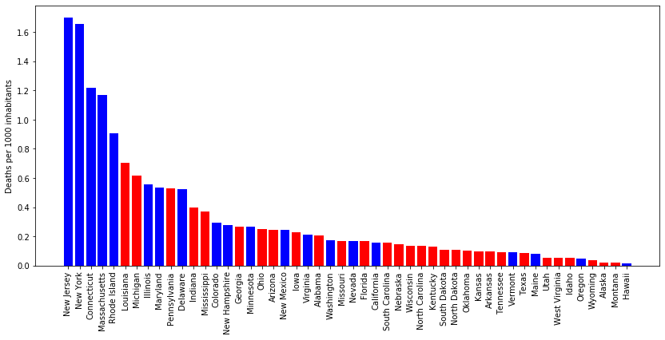
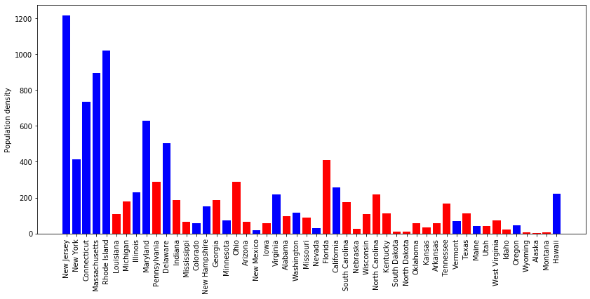
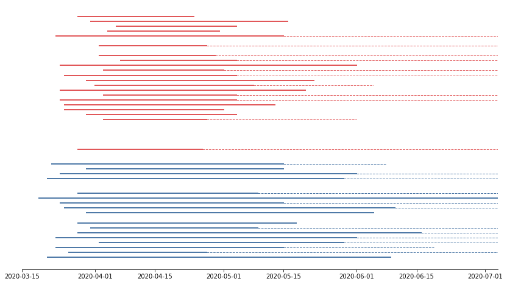

# Project 6 - Visualizing Real World Data

Project by Shelley Obery, Nicholas Gotzens and João Fernandes

## Project Description

This project is part of the IronHack Data Analytics Bootcamp and its goal is to practice creating and interpreting different types of visualizations using real world data, as well as statistical analysis. 

Our team decided to work on the topic of Covid-19 in the USA.
_______

## Questions & Hypotheses

We were interested in understanding whether there were differences between Democrat and Republican states in terms of handling and progression of the COVID-19 pandemic. Specifically, we wanted to answer the following:

- Were there differences in the number of confirmed cases or deaths (total numbers and per 1000 inhabitants) in each state?
- How did government mandatory statewide policies affect the number of cases or deaths?
- Did the policy implementation differ between Democrat and Republican states?

Our Hypotheses: There would be no correlation between a state's progression of the virus and whether said state is Democrat or Republican.
_________

## Data

#### Covid-19 epidemiological data

We retrieved data regarding the number of confirmed cases, deaths and recoveries for each US state from Datahub ([here](https://datahub.io/core/covid-19#resource-covid-19_zip)). This data covered the time period between 2020-01-22 and 2020-07-04. It was available as a csv file, which can be found in the raw_data folder.

#### Data on testing by state

Data concerning testing by state was obtained from the Covid Tracking Project API [here](https://covidtracking.com/data/download).

#### Covid-19 policy data

Data regarding the different policies enacted in each US state, including the days when they were enacted, was retrieved from Github ([here](https://github.com/COVID19StatePolicy/SocialDistancing/blob/master/data/USstatesCov19distancingpolicy.csv)). It was available as a csv file, which can be found in the raw_data folder.

#### US political data

For data regarding the political landscape of each state in the US, we scraped [this](https://en.wikipedia.org/wiki/Political_party_strength_in_U.S._states) wikipedia page, which contained a table with all the information we needed. The code is available in notebook 3 and the resulting table was stored as a csv file in the data folder.

#### US population data

State population and population density were obtained from [here](https://worldpopulationreview.com/state-rankings/state-densities) as a csv file and can be found in the raw_data folder
__________

## Workflow & Organization

We first discussed possible topics of interest. Later, we decided on the topic of Covid-19 in the U.S. and developed a Trello Board in order to get an overview of the different tasks necessary. We then allocated the tasks, which included data wrangling, data cleaning, the analysis of the data, as well as its visualisation and the creation of a presentation. We met regularly every day, every one to two hours, to discuss our progress and the next steps.

In that context, we worked together on the analysis and created visualizations using Tableau Public for our presentation. Yet, the heart of the analysis is the graphs using Matplotlib in the Jupyter Notebook 4. After this process, we created a presentation that would condense the information into a 5 minute time slot. We also conducted domain research whenever important questions or unexpected points in the data arose.

Our Jupyter Notebooks are ordered as follows:

1. *Covid19 cases in USA - data cleaning.ipynb*: data cleaning for state-specific number of confirmed cases and deaths.
2. *Policy data - data cleaning.ipynb*: data cleaning and merging for state-specific policy data and confirmed cases and deaths. 
3. *Political control by state - Webscraping and data cleaning.ipynb*: web-scraping and data cleaning for the political information for each state.
4. *Analysis.ipynb*: contains ttests, plots and analyses of the data wrangled and structured in notebooks 1 - 3.

Please note:

- The *data* folder contains cleaned and exported data.
- The *raw data* folder contains the original csv files we obtained from other sites.

## Analysis

*Please refer to [Notebook 4*](https://github.com/JMiguelFernandes/Project-6---Coronavirus-in-the-US/blob/master/4.%20Analysis.ipynb)

1. We first looked into the number of confirmed infections and deaths per state, matching this information with the political party strength in each state based on how they voted in the 2016 elections. The results of our ttests could not confirm any correlation between how states voted and their number of confirmed infections or deaths. We did, however, find that the number of deaths per 1000 inhabitants for Democrat states was significantly higher. We suggest that the reason for this is geographical, as the virus hit the (mostly Democrat) northeast coast the hardest, with New York being the epicenter of the pandemic for quite some time. Due to the multiple levels of US government that contribute to policy making, we decided to also look at the affliation of Govenors for each state, as they are responsible for issuing statewide orders, but the difference in the number of deaths per 1000 inhabitants remained significant at a 95% confidence level.

2. We then took a look at population density per state and found a correlation with the number of deaths per 1000 inhabitants. The following plot shows states ordered by deaths per 1000 inhabitants and the y-axis indicates population density.

3. Next we tested for correlations between enactment, duration and easing of mandatory statewide stay at home and public mask orders and the number of confirmed infections and deaths. We did not observe any meaningful correlations. We decided to look at states individually, but could draw no definitive conclusions from our plots. Even though we saw significant differences between the implementation of policies between Democrat and Republican states, policy official start dates, end dates and duration did not have a uniform effect on confirmed infections or deaths. The following plot shows the lengths, start dates, end dates and easing off periods for Democrat (blue) and Republican (red) states.

4. We also looked at differences in testing between Democrat and Republican states, but found no significant differences in the total number of tests per 1000 inhabitants by 2020.07.04 (the last day for which we have data).

## Links

* [Trello](https://trello.com/b/vm5KySnv/week-6-project)
* [Tableau 1](https://public.tableau.com/profile/nicholas5299#!/vizhome/Week6Project_15941277490120/PopulationdensitywithinthestatesoftheUSAincorrelationwithconfirmedcasesofCovid-19)
* [Tableau 2](https://public.tableau.com/profile/nicholas5299#!/vizhome/LengthsofpolicyWeek6/Blatt1)
* [Presentation](https://docs.google.com/presentation/d/18exl3zWcM4C_qBaOxa7t_OlXZhz9xOK7Gt3vN9Uxxew/edit#slide=id.gc6f9e470d_0_0)
